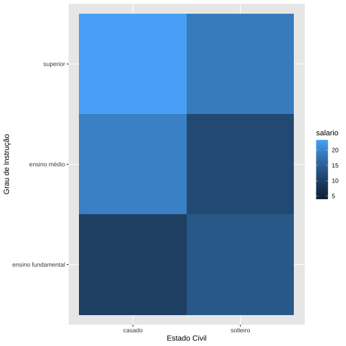
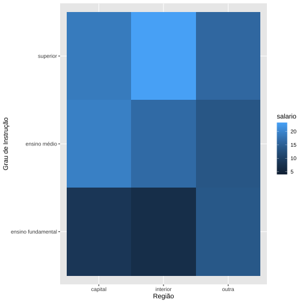
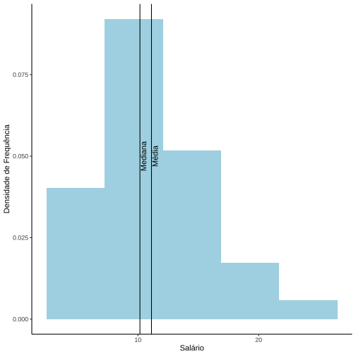
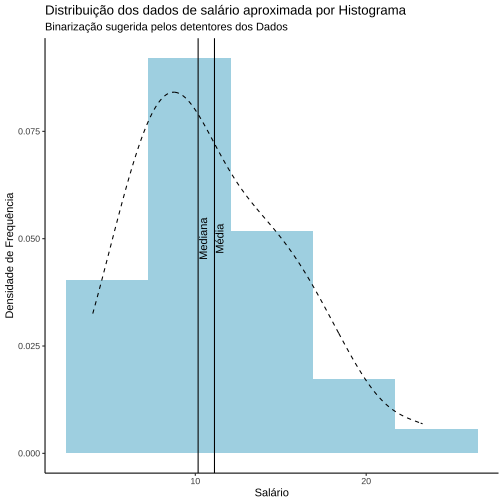
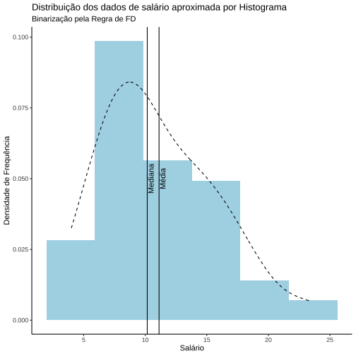
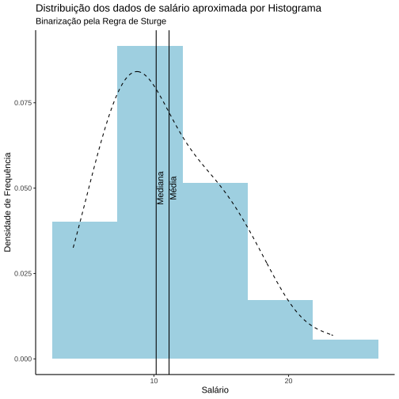
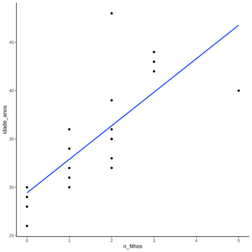
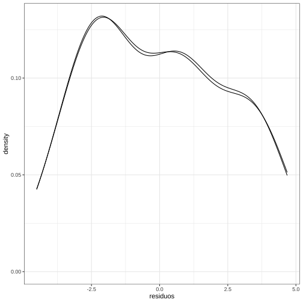

## Introdução

Com a análise de salários, temos o objetivo de abrir uma base de dados e dar os primeiros passos em análise estatística dessa base. Essa análise começou na disciplina Estatística para Ciência de Dados e continuou até Análise Exploratória de dados.

Como sempre, o primeiro passo é importar as bibliotecas que serão utilizadas para análise, como tydiverse, summarytools e dlookr.


```r
library(tidyverse)
library(dlookr)
library(summarytools)
library(readxl)
library(knitr)
library(stargazer)
library(mice)
library(rmarkdown)
library(tinytex)
library(sandwich)
library(magrittr)
```

A base trabalhada nesta aula, será a base de dados hipotética disponbilizada no livro texto dos autores Bussab e Moretim. Vamos importá-la e imprimir as primeiras observações para conhecimento das variáveis.

#```{r importando dados, echo = FALSE}
#salarios <- readxl::read_excel("/Users/ottotavares/Library/Mobile Documents/com~apple~CloudDocs/Documents/infnet/Estatistica para Ciência de Dados/dados_utilizados/dados_bussab_m.xlsx")
#```


```r
kable(salarios)
```

<table>
 <thead>
  <tr>
   <th style="text-align:right;"> n </th>
   <th style="text-align:left;"> estado_civil </th>
   <th style="text-align:left;"> Grau_de_instrucao </th>
   <th style="text-align:right;"> n_filhos </th>
   <th style="text-align:right;"> salario </th>
   <th style="text-align:right;"> idade_anos </th>
   <th style="text-align:right;"> idade_meses </th>
   <th style="text-align:left;"> regiao </th>
  </tr>
 </thead>
<tbody>
  <tr>
   <td style="text-align:right;"> 1 </td>
   <td style="text-align:left;"> solteiro </td>
   <td style="text-align:left;"> ensino fundamental </td>
   <td style="text-align:right;"> NA </td>
   <td style="text-align:right;"> 4.00 </td>
   <td style="text-align:right;"> 26 </td>
   <td style="text-align:right;"> 3 </td>
   <td style="text-align:left;"> interior </td>
  </tr>
  <tr>
   <td style="text-align:right;"> 2 </td>
   <td style="text-align:left;"> casado </td>
   <td style="text-align:left;"> ensino fundamental </td>
   <td style="text-align:right;"> 1 </td>
   <td style="text-align:right;"> 4.56 </td>
   <td style="text-align:right;"> 32 </td>
   <td style="text-align:right;"> 10 </td>
   <td style="text-align:left;"> capital </td>
  </tr>
  <tr>
   <td style="text-align:right;"> 3 </td>
   <td style="text-align:left;"> casado </td>
   <td style="text-align:left;"> ensino fundamental </td>
   <td style="text-align:right;"> 2 </td>
   <td style="text-align:right;"> 5.25 </td>
   <td style="text-align:right;"> 36 </td>
   <td style="text-align:right;"> 5 </td>
   <td style="text-align:left;"> capital </td>
  </tr>
  <tr>
   <td style="text-align:right;"> 4 </td>
   <td style="text-align:left;"> solteiro </td>
   <td style="text-align:left;"> ensino médio </td>
   <td style="text-align:right;"> NA </td>
   <td style="text-align:right;"> 5.73 </td>
   <td style="text-align:right;"> 20 </td>
   <td style="text-align:right;"> 10 </td>
   <td style="text-align:left;"> outra </td>
  </tr>
  <tr>
   <td style="text-align:right;"> 5 </td>
   <td style="text-align:left;"> solteiro </td>
   <td style="text-align:left;"> ensino fundamental </td>
   <td style="text-align:right;"> NA </td>
   <td style="text-align:right;"> 6.26 </td>
   <td style="text-align:right;"> 40 </td>
   <td style="text-align:right;"> 7 </td>
   <td style="text-align:left;"> outra </td>
  </tr>
  <tr>
   <td style="text-align:right;"> 6 </td>
   <td style="text-align:left;"> casado </td>
   <td style="text-align:left;"> ensino fundamental </td>
   <td style="text-align:right;"> 0 </td>
   <td style="text-align:right;"> 6.66 </td>
   <td style="text-align:right;"> 28 </td>
   <td style="text-align:right;"> 0 </td>
   <td style="text-align:left;"> interior </td>
  </tr>
  <tr>
   <td style="text-align:right;"> 7 </td>
   <td style="text-align:left;"> solteiro </td>
   <td style="text-align:left;"> ensino fundamental </td>
   <td style="text-align:right;"> NA </td>
   <td style="text-align:right;"> 6.86 </td>
   <td style="text-align:right;"> 41 </td>
   <td style="text-align:right;"> 0 </td>
   <td style="text-align:left;"> interior </td>
  </tr>
  <tr>
   <td style="text-align:right;"> 8 </td>
   <td style="text-align:left;"> solteiro </td>
   <td style="text-align:left;"> ensino fundamental </td>
   <td style="text-align:right;"> NA </td>
   <td style="text-align:right;"> 7.39 </td>
   <td style="text-align:right;"> 43 </td>
   <td style="text-align:right;"> 4 </td>
   <td style="text-align:left;"> capital </td>
  </tr>
  <tr>
   <td style="text-align:right;"> 9 </td>
   <td style="text-align:left;"> casado </td>
   <td style="text-align:left;"> ensino médio </td>
   <td style="text-align:right;"> 1 </td>
   <td style="text-align:right;"> 7.59 </td>
   <td style="text-align:right;"> 34 </td>
   <td style="text-align:right;"> 10 </td>
   <td style="text-align:left;"> capital </td>
  </tr>
  <tr>
   <td style="text-align:right;"> 10 </td>
   <td style="text-align:left;"> solteiro </td>
   <td style="text-align:left;"> ensino médio </td>
   <td style="text-align:right;"> NA </td>
   <td style="text-align:right;"> 7.44 </td>
   <td style="text-align:right;"> 23 </td>
   <td style="text-align:right;"> 6 </td>
   <td style="text-align:left;"> outra </td>
  </tr>
  <tr>
   <td style="text-align:right;"> 11 </td>
   <td style="text-align:left;"> casado </td>
   <td style="text-align:left;"> ensino médio </td>
   <td style="text-align:right;"> 2 </td>
   <td style="text-align:right;"> 8.12 </td>
   <td style="text-align:right;"> 33 </td>
   <td style="text-align:right;"> 6 </td>
   <td style="text-align:left;"> interior </td>
  </tr>
  <tr>
   <td style="text-align:right;"> 12 </td>
   <td style="text-align:left;"> solteiro </td>
   <td style="text-align:left;"> ensino fundamental </td>
   <td style="text-align:right;"> NA </td>
   <td style="text-align:right;"> 8.46 </td>
   <td style="text-align:right;"> 27 </td>
   <td style="text-align:right;"> 11 </td>
   <td style="text-align:left;"> capital </td>
  </tr>
  <tr>
   <td style="text-align:right;"> 13 </td>
   <td style="text-align:left;"> solteiro </td>
   <td style="text-align:left;"> ensino médio </td>
   <td style="text-align:right;"> NA </td>
   <td style="text-align:right;"> 8.74 </td>
   <td style="text-align:right;"> 37 </td>
   <td style="text-align:right;"> 5 </td>
   <td style="text-align:left;"> outra </td>
  </tr>
  <tr>
   <td style="text-align:right;"> 14 </td>
   <td style="text-align:left;"> casado </td>
   <td style="text-align:left;"> ensino fundamental </td>
   <td style="text-align:right;"> 3 </td>
   <td style="text-align:right;"> 8.95 </td>
   <td style="text-align:right;"> 44 </td>
   <td style="text-align:right;"> 2 </td>
   <td style="text-align:left;"> outra </td>
  </tr>
  <tr>
   <td style="text-align:right;"> 15 </td>
   <td style="text-align:left;"> casado </td>
   <td style="text-align:left;"> ensino médio </td>
   <td style="text-align:right;"> 0 </td>
   <td style="text-align:right;"> 9.13 </td>
   <td style="text-align:right;"> 30 </td>
   <td style="text-align:right;"> 5 </td>
   <td style="text-align:left;"> interior </td>
  </tr>
  <tr>
   <td style="text-align:right;"> 16 </td>
   <td style="text-align:left;"> solteiro </td>
   <td style="text-align:left;"> ensino médio </td>
   <td style="text-align:right;"> NA </td>
   <td style="text-align:right;"> 9.35 </td>
   <td style="text-align:right;"> 38 </td>
   <td style="text-align:right;"> 8 </td>
   <td style="text-align:left;"> outra </td>
  </tr>
  <tr>
   <td style="text-align:right;"> 17 </td>
   <td style="text-align:left;"> casado </td>
   <td style="text-align:left;"> ensino médio </td>
   <td style="text-align:right;"> 1 </td>
   <td style="text-align:right;"> 9.77 </td>
   <td style="text-align:right;"> 31 </td>
   <td style="text-align:right;"> 7 </td>
   <td style="text-align:left;"> capital </td>
  </tr>
  <tr>
   <td style="text-align:right;"> 18 </td>
   <td style="text-align:left;"> casado </td>
   <td style="text-align:left;"> ensino fundamental </td>
   <td style="text-align:right;"> 2 </td>
   <td style="text-align:right;"> 9.80 </td>
   <td style="text-align:right;"> 39 </td>
   <td style="text-align:right;"> 7 </td>
   <td style="text-align:left;"> outra </td>
  </tr>
  <tr>
   <td style="text-align:right;"> 19 </td>
   <td style="text-align:left;"> solteiro </td>
   <td style="text-align:left;"> superior </td>
   <td style="text-align:right;"> NA </td>
   <td style="text-align:right;"> 10.53 </td>
   <td style="text-align:right;"> 25 </td>
   <td style="text-align:right;"> 8 </td>
   <td style="text-align:left;"> interior </td>
  </tr>
  <tr>
   <td style="text-align:right;"> 20 </td>
   <td style="text-align:left;"> solteiro </td>
   <td style="text-align:left;"> ensino médio </td>
   <td style="text-align:right;"> NA </td>
   <td style="text-align:right;"> 10.76 </td>
   <td style="text-align:right;"> 37 </td>
   <td style="text-align:right;"> 4 </td>
   <td style="text-align:left;"> interior </td>
  </tr>
  <tr>
   <td style="text-align:right;"> 21 </td>
   <td style="text-align:left;"> casado </td>
   <td style="text-align:left;"> ensino médio </td>
   <td style="text-align:right;"> 1 </td>
   <td style="text-align:right;"> 11.06 </td>
   <td style="text-align:right;"> 30 </td>
   <td style="text-align:right;"> 9 </td>
   <td style="text-align:left;"> outra </td>
  </tr>
  <tr>
   <td style="text-align:right;"> 22 </td>
   <td style="text-align:left;"> solteiro </td>
   <td style="text-align:left;"> ensino médio </td>
   <td style="text-align:right;"> NA </td>
   <td style="text-align:right;"> 11.59 </td>
   <td style="text-align:right;"> 34 </td>
   <td style="text-align:right;"> 2 </td>
   <td style="text-align:left;"> capital </td>
  </tr>
  <tr>
   <td style="text-align:right;"> 23 </td>
   <td style="text-align:left;"> solteiro </td>
   <td style="text-align:left;"> ensino fundamental </td>
   <td style="text-align:right;"> NA </td>
   <td style="text-align:right;"> 12.00 </td>
   <td style="text-align:right;"> 41 </td>
   <td style="text-align:right;"> 0 </td>
   <td style="text-align:left;"> outra </td>
  </tr>
  <tr>
   <td style="text-align:right;"> 24 </td>
   <td style="text-align:left;"> casado </td>
   <td style="text-align:left;"> superior </td>
   <td style="text-align:right;"> 0 </td>
   <td style="text-align:right;"> 12.79 </td>
   <td style="text-align:right;"> 26 </td>
   <td style="text-align:right;"> 1 </td>
   <td style="text-align:left;"> outra </td>
  </tr>
  <tr>
   <td style="text-align:right;"> 25 </td>
   <td style="text-align:left;"> casado </td>
   <td style="text-align:left;"> ensino médio </td>
   <td style="text-align:right;"> 2 </td>
   <td style="text-align:right;"> 13.23 </td>
   <td style="text-align:right;"> 32 </td>
   <td style="text-align:right;"> 5 </td>
   <td style="text-align:left;"> interior </td>
  </tr>
  <tr>
   <td style="text-align:right;"> 26 </td>
   <td style="text-align:left;"> casado </td>
   <td style="text-align:left;"> ensino médio </td>
   <td style="text-align:right;"> 2 </td>
   <td style="text-align:right;"> 13.60 </td>
   <td style="text-align:right;"> 35 </td>
   <td style="text-align:right;"> 0 </td>
   <td style="text-align:left;"> outra </td>
  </tr>
  <tr>
   <td style="text-align:right;"> 27 </td>
   <td style="text-align:left;"> solteiro </td>
   <td style="text-align:left;"> ensino fundamental </td>
   <td style="text-align:right;"> NA </td>
   <td style="text-align:right;"> 13.85 </td>
   <td style="text-align:right;"> 46 </td>
   <td style="text-align:right;"> 7 </td>
   <td style="text-align:left;"> outra </td>
  </tr>
  <tr>
   <td style="text-align:right;"> 28 </td>
   <td style="text-align:left;"> casado </td>
   <td style="text-align:left;"> ensino médio </td>
   <td style="text-align:right;"> 0 </td>
   <td style="text-align:right;"> 14.69 </td>
   <td style="text-align:right;"> 29 </td>
   <td style="text-align:right;"> 8 </td>
   <td style="text-align:left;"> interior </td>
  </tr>
  <tr>
   <td style="text-align:right;"> 29 </td>
   <td style="text-align:left;"> casado </td>
   <td style="text-align:left;"> ensino médio </td>
   <td style="text-align:right;"> 5 </td>
   <td style="text-align:right;"> 14.71 </td>
   <td style="text-align:right;"> 40 </td>
   <td style="text-align:right;"> 6 </td>
   <td style="text-align:left;"> interior </td>
  </tr>
  <tr>
   <td style="text-align:right;"> 30 </td>
   <td style="text-align:left;"> casado </td>
   <td style="text-align:left;"> ensino médio </td>
   <td style="text-align:right;"> 2 </td>
   <td style="text-align:right;"> 15.99 </td>
   <td style="text-align:right;"> 35 </td>
   <td style="text-align:right;"> 10 </td>
   <td style="text-align:left;"> capital </td>
  </tr>
  <tr>
   <td style="text-align:right;"> 31 </td>
   <td style="text-align:left;"> solteiro </td>
   <td style="text-align:left;"> superior </td>
   <td style="text-align:right;"> NA </td>
   <td style="text-align:right;"> 16.22 </td>
   <td style="text-align:right;"> 31 </td>
   <td style="text-align:right;"> 5 </td>
   <td style="text-align:left;"> outra </td>
  </tr>
  <tr>
   <td style="text-align:right;"> 32 </td>
   <td style="text-align:left;"> casado </td>
   <td style="text-align:left;"> ensino médio </td>
   <td style="text-align:right;"> 1 </td>
   <td style="text-align:right;"> 16.61 </td>
   <td style="text-align:right;"> 36 </td>
   <td style="text-align:right;"> 4 </td>
   <td style="text-align:left;"> interior </td>
  </tr>
  <tr>
   <td style="text-align:right;"> 33 </td>
   <td style="text-align:left;"> casado </td>
   <td style="text-align:left;"> superior </td>
   <td style="text-align:right;"> 3 </td>
   <td style="text-align:right;"> 17.26 </td>
   <td style="text-align:right;"> 43 </td>
   <td style="text-align:right;"> 7 </td>
   <td style="text-align:left;"> capital </td>
  </tr>
  <tr>
   <td style="text-align:right;"> 34 </td>
   <td style="text-align:left;"> solteiro </td>
   <td style="text-align:left;"> superior </td>
   <td style="text-align:right;"> NA </td>
   <td style="text-align:right;"> 18.75 </td>
   <td style="text-align:right;"> 33 </td>
   <td style="text-align:right;"> 7 </td>
   <td style="text-align:left;"> capital </td>
  </tr>
  <tr>
   <td style="text-align:right;"> 35 </td>
   <td style="text-align:left;"> casado </td>
   <td style="text-align:left;"> ensino médio </td>
   <td style="text-align:right;"> 2 </td>
   <td style="text-align:right;"> 19.40 </td>
   <td style="text-align:right;"> 48 </td>
   <td style="text-align:right;"> 11 </td>
   <td style="text-align:left;"> capital </td>
  </tr>
  <tr>
   <td style="text-align:right;"> 36 </td>
   <td style="text-align:left;"> casado </td>
   <td style="text-align:left;"> superior </td>
   <td style="text-align:right;"> 3 </td>
   <td style="text-align:right;"> 23.30 </td>
   <td style="text-align:right;"> 42 </td>
   <td style="text-align:right;"> 2 </td>
   <td style="text-align:left;"> interior </td>
  </tr>
</tbody>
</table>

### Identificando os tipos de cada variável na base

Para identificar os tipos de cada variável na base, vamos utilizar a função diagnose do pacote dlookr e reportar o tipo de cada um para melhor trabalharmos os dados.


```r
salarios %>% dlookr::diagnose()  %>% kable()
```

<table>
 <thead>
  <tr>
   <th style="text-align:left;"> variables </th>
   <th style="text-align:left;"> types </th>
   <th style="text-align:right;"> missing_count </th>
   <th style="text-align:right;"> missing_percent </th>
   <th style="text-align:right;"> unique_count </th>
   <th style="text-align:right;"> unique_rate </th>
  </tr>
 </thead>
<tbody>
  <tr>
   <td style="text-align:left;"> n </td>
   <td style="text-align:left;"> numeric </td>
   <td style="text-align:right;"> 0 </td>
   <td style="text-align:right;"> 0.00000 </td>
   <td style="text-align:right;"> 36 </td>
   <td style="text-align:right;"> 1.0000000 </td>
  </tr>
  <tr>
   <td style="text-align:left;"> estado_civil </td>
   <td style="text-align:left;"> character </td>
   <td style="text-align:right;"> 0 </td>
   <td style="text-align:right;"> 0.00000 </td>
   <td style="text-align:right;"> 2 </td>
   <td style="text-align:right;"> 0.0555556 </td>
  </tr>
  <tr>
   <td style="text-align:left;"> Grau_de_instrucao </td>
   <td style="text-align:left;"> character </td>
   <td style="text-align:right;"> 0 </td>
   <td style="text-align:right;"> 0.00000 </td>
   <td style="text-align:right;"> 3 </td>
   <td style="text-align:right;"> 0.0833333 </td>
  </tr>
  <tr>
   <td style="text-align:left;"> n_filhos </td>
   <td style="text-align:left;"> numeric </td>
   <td style="text-align:right;"> 16 </td>
   <td style="text-align:right;"> 44.44444 </td>
   <td style="text-align:right;"> 6 </td>
   <td style="text-align:right;"> 0.1666667 </td>
  </tr>
  <tr>
   <td style="text-align:left;"> salario </td>
   <td style="text-align:left;"> numeric </td>
   <td style="text-align:right;"> 0 </td>
   <td style="text-align:right;"> 0.00000 </td>
   <td style="text-align:right;"> 36 </td>
   <td style="text-align:right;"> 1.0000000 </td>
  </tr>
  <tr>
   <td style="text-align:left;"> idade_anos </td>
   <td style="text-align:left;"> numeric </td>
   <td style="text-align:right;"> 0 </td>
   <td style="text-align:right;"> 0.00000 </td>
   <td style="text-align:right;"> 24 </td>
   <td style="text-align:right;"> 0.6666667 </td>
  </tr>
  <tr>
   <td style="text-align:left;"> idade_meses </td>
   <td style="text-align:left;"> numeric </td>
   <td style="text-align:right;"> 0 </td>
   <td style="text-align:right;"> 0.00000 </td>
   <td style="text-align:right;"> 12 </td>
   <td style="text-align:right;"> 0.3333333 </td>
  </tr>
  <tr>
   <td style="text-align:left;"> regiao </td>
   <td style="text-align:left;"> character </td>
   <td style="text-align:right;"> 0 </td>
   <td style="text-align:right;"> 0.00000 </td>
   <td style="text-align:right;"> 3 </td>
   <td style="text-align:right;"> 0.0833333 </td>
  </tr>
</tbody>
</table>

É fácil ver que na base há três variáveis qualitativas, sendo as variáveis Estado Civil e região nominais, enquanto a variável Grau de Instrução é ordinal.

Sobre as variáveis quantitativas, temos número de filhos e idade com variáveis discretas, equanto a variável salário é contínua.

## Análise de frequências de variáveis qualitativas

A variável região é uma das variáveis qualitativas nominais da base, sendo uma variável interessante para extraírmos as frequências. Para esse caso, vamos utilizar a função freq() do pacote summarytools


### Frequências da variável região


```r
salarios %>% dplyr::select(regiao) %>% summarytools::freq(style = "rmarkdown", headings = FALSE)
```

```
## setting plain.ascii to FALSE
```


|       &nbsp; | Freq | % Valid | % Valid Cum. | % Total | % Total Cum. |
|-------------:|-----:|--------:|-------------:|--------:|-------------:|
|  **capital** |   11 |   30.56 |        30.56 |   30.56 |        30.56 |
| **interior** |   12 |   33.33 |        63.89 |   33.33 |        63.89 |
|    **outra** |   13 |   36.11 |       100.00 |   36.11 |       100.00 |
|   **\<NA\>** |    0 |         |              |    0.00 |       100.00 |
|    **Total** |   36 |  100.00 |       100.00 |  100.00 |       100.00 |

Nas colunas Freq, temos a frequência absoluta, mostrando um grau de bastante homogeneidade entre as classes. Padrão esse, que é confirmado com a coluna Valid, que apresenta as frequências relativas de cada opção de região. 

Podemos fazer a mesma análise para os dados de estado civil, os quais podemos estar interessados em buscar evidência se há mais funcionários casados ou solteiros na empresa. A seguir, temos a tabela destas proporções, onde é perceptível que há maior proporção de funcionários casados.


### Frequências da variável estado civil


```r
salarios %>% dplyr::select(estado_civil) %>% summarytools::freq(style = "rmarkdown", headings = FALSE)
```

```
## setting plain.ascii to FALSE
```


|       &nbsp; | Freq | % Valid | % Valid Cum. | % Total | % Total Cum. |
|-------------:|-----:|--------:|-------------:|--------:|-------------:|
|   **casado** |   20 |   55.56 |        55.56 |   55.56 |        55.56 |
| **solteiro** |   16 |   44.44 |       100.00 |   44.44 |       100.00 |
|   **\<NA\>** |    0 |         |              |    0.00 |       100.00 |
|    **Total** |   36 |  100.00 |       100.00 |  100.00 |       100.00 |

É importante destacar, que lemos a coluna Valid sem nos preocupar nestes casos, pois não há dados faltantes para nenhumas das duas variáveis.


Por fim, podemos criar tabelas de frequências para uma variável quantitativa discreta, como é o caso do número de filhos dos funcionários da empresa. 

### Frequências da variável número de filhos


```r
salarios %>% dplyr::select(n_filhos) %>% summarytools::freq(style = "rmarkdown", headings = FALSE)
```

```
## setting plain.ascii to FALSE
```


|     &nbsp; | Freq | % Valid | % Valid Cum. | % Total | % Total Cum. |
|-----------:|-----:|--------:|-------------:|--------:|-------------:|
|      **0** |    4 |   20.00 |        20.00 |   11.11 |        11.11 |
|      **1** |    5 |   25.00 |        45.00 |   13.89 |        25.00 |
|      **2** |    7 |   35.00 |        80.00 |   19.44 |        44.44 |
|      **3** |    3 |   15.00 |        95.00 |    8.33 |        52.78 |
|      **5** |    1 |    5.00 |       100.00 |    2.78 |        55.56 |
| **\<NA\>** |   16 |         |              |   44.44 |       100.00 |
|  **Total** |   36 |  100.00 |       100.00 |  100.00 |       100.00 |

Como há dados faltantes para essa variável, é importante o analista determinar qual o espaço amostral está interessado em focar sua análise. 

A fim de ser comparável às análises pregressas, é importante que as frequências absoluta e relativa do total de dados seja considerada, isto é, leitura da coluna Total, a fim de manter o mesmo espaço amostral.

Caso, ele esteja interessado em analisar apenas os dados válidos, ele pode redefinir o espaço amostral, ler apenas a coluna Valid, porém recalculando as tabelas anteriores, considerando os indivíduos apenas com dados preenchidos para a variável filhos.

## Relação entre variáveis categóricas


De posse de variáveis categóricas ou representadas de forma discreta, podemos calcular suas tabelas de contingências. Essas tabelas retornam as relações, em termos de frequências absoluta e relativa, da ocorrência simultânea de cada valor presente nas variáveis categóricas.

Com essas tabelas, somos capazes de quantificar quanto as variáveis categóricas podem estar relacionadas e nos permetir extrair insights dessas relações.

Dessa forma, a primeira pergunta que nos ocorre na base de salários é se há algum padrão evidente entre grau de instrução e a região de origem do trabalhador. Isto é, será que há prevalescência de mais pessoas com ensino superior na capital, por exemplo?


```r
salarios %$% summarytools::ctable(x = Grau_de_instrucao, 
       y = regiao, 
       prop = "r")
```

Cross-Tabulation, Row Proportions  
Grau_de_instrucao * regiao  
Data Frame: salarios  

-------------------- -------- ------------ ------------ ------------ -------------
                       regiao      capital     interior        outra         Total
   Grau_de_instrucao                                                              
  ensino fundamental             4 (33.3%)    3 (25.0%)    5 (41.7%)   12 (100.0%)
        ensino médio             5 (27.8%)    7 (38.9%)    6 (33.3%)   18 (100.0%)
            superior             2 (33.3%)    2 (33.3%)    2 (33.3%)    6 (100.0%)
               Total            11 (30.6%)   12 (33.3%)   13 (36.1%)   36 (100.0%)
-------------------- -------- ------------ ------------ ------------ -------------

Percebe-se que a distribuição é bem uniforme, isto é, não relação evidente entre o padrão de grau de instrução e a região que o indivíduo desta base mora.


```r
salarios %$%
  summarytools::ctable(x = factor(n_filhos), 
       y = estado_civil, 
       prop = "r") 
```

Cross-Tabulation, Row Proportions  
n_filhos * estado_civil  

---------- -------------- ------------- ------------- -------------
             estado_civil        casado      solteiro         Total
  n_filhos                                                         
         0                   4 (100.0%)    0 (  0.0%)    4 (100.0%)
         1                   5 (100.0%)    0 (  0.0%)    5 (100.0%)
         2                   7 (100.0%)    0 (  0.0%)    7 (100.0%)
         3                   3 (100.0%)    0 (  0.0%)    3 (100.0%)
         5                   1 (100.0%)    0 (  0.0%)    1 (100.0%)
      <NA>                   0 (  0.0%)   16 (100.0%)   16 (100.0%)
     Total                  20 ( 55.6%)   16 ( 44.4%)   36 (100.0%)
---------- -------------- ------------- ------------- -------------

Um detalhe extra é que essas tabelas são muito utilizadas em cursos de teoria da probabilidade para quantificar distribuições conjuntas de eventos discretos, onde os somatórios de suas linhas retorna a distribuição marginal de cada variável representada nas colunas, enquanto a soma de suas colunas representam a distribuição marginal das variáveis que estão representadas nas linhas.


```r
salarios %>% ggplot(aes(x = estado_civil, y = Grau_de_instrucao, fill = salario)) + geom_tile() + xlab('Estado Civil') + ylab('Grau de Instrução')
```




```r
salarios %>% ggplot(aes(x = regiao, y = Grau_de_instrucao, fill = salario)) + geom_tile() + xlab('Região') + ylab('Grau de Instrução')
```



##Análise descritiva e de histogramas de uma variável contínua

Já para a variável salários, podemos analisar a centralidade dos dados, dipersão, assimetria, bem como suas estatísticas de ordem, a fim de checar se há presença de outliers.

Para realizar essa análise, podemos utilizar a função descr do pacote summarytools, e posteriormente realizar a leitura desses dados.


```r
salarios %>% dplyr::select(salario) %>% summarytools::descr()
```

Descriptive Statistics  
salarios$salario  
N: 36  

                    salario
----------------- ---------
             Mean     11.12
          Std.Dev      4.59
              Min      4.00
               Q1      7.52
           Median     10.16
               Q3     14.27
              Max     23.30
              MAD      4.72
              IQR      6.51
               CV      0.41
         Skewness      0.60
      SE.Skewness      0.39
         Kurtosis     -0.33
          N.Valid     36.00
        Pct.Valid    100.00

É possível ver pelo critério de skewness discutido em aula, que o valor de 0.6 para assimetria, nos faz interpretar essa distribução como levemente assimétrica, com cauda à direita.

Em decorrência desta assimetria, observamos que média e mediana apresentam valores distintos, com a média tendo valor levemente superior, o que aponta que os valores mais distantes do centro da distribuição puxam o valor da média pra cima. 

Já a mediana por ser uma estatística de ordem, não é sensível a dados que apresentam alto valor na distribuição, o que é reforçado por seu valor levemente mais baixo que a média.

Reparem que se tivéssemos outliers nesta distribuição a média se descolaria ainda mais da mediana, pois estaria totalmente suscetível à contaminação.

##Análise visual da variável salário

Para realizar a análise visual da variável salários, seguimos o padrão de binarização recomendado pelos detentores dos dados. No entanto, reparem que se estivésses interessados em outras regras de binarização seríamos livres para escolher. 

Devemos sempre ter em mente que escolher bins para aproximar a distribuição de probabilidade de uma determinada variável nos incorre em perda de informação, uma vez que estamos tratando como indiferentes eventos distintos para estarem em grupos contíguous do histograma.


```r
salarios %>% dplyr::select(salario) %>% ggplot(aes(x=salario))+geom_histogram(aes(y = after_stat(density)) ,bins = 5, fill = 'lightblue') + xlab('Salário') + ylab('Densidade de Frequência') + geom_vline(xintercept=c(median(salarios$salario), mean(salarios$salario))) + annotate("text", x=median(salarios$salario) + 0.3, y=0.05, label="Mediana", angle=90) + annotate("text", x=mean(salarios$salario) + 0.3, y=0.05, label="Média", angle=90) + theme_classic()
```




Reparem por essa visualização que a leitura visual nos leva a conclusões semelhantes a nossa leitura das estatísticas descritas, como por exemplo:

1. Leve assimetria com cauda à direita
2. Centralidade dos dados calculada pela média sofre leve contaminação dos valores mais distantes do centro da distribuição
3. Por mais que sejam poucas observações os dados não apresentam dispersão elevada, tendo a maioria dos dados concentrada próxima ao centro da distribuição.

É importante dizer, que o tamanho da perda de informação, ao aproximar a distribuição por um histograma, será proporcional ao espaço que o histograma deixa de preencher como distância da distribuição original dos dados.

Por mais que a estimativa por kernel não seja a distribuição original dos dados, ela tende a ser mais próxima da mesma. Logo, temos uma certa leitura aproximada do tamanho de informação perdida com a análise que segue.


```r
salarios %>% dplyr::select(salario) %>% ggplot(aes(x=salario))+geom_histogram(aes(y = after_stat(density)) ,bins = 5, fill = 'lightblue') + xlab('Salário') + ylab('Densidade de Frequência') + labs(title = "Distribuição dos dados de salário aproximada por Histograma", subtitle = "Binarização sugerida pelos detentores dos Dados") + geom_vline(xintercept=c(median(salarios$salario), mean(salarios$salario))) + annotate("text", x=median(salarios$salario) + 0.3, y=0.05, label="Mediana", angle=90) + annotate("text", x=mean(salarios$salario) + 0.3, y=0.05, label="Média", angle=90) + geom_density(linetype = 2) + theme_classic()
```



Poderíamos também considerar outras regra de binarização levando em consideração regras disponíveis na literatura, como a regra de Freedman-Diaconis, bem como a regra de Sturge, como segue:


```r
fd <- function(x) {
  n <-length(x)
  return((2*IQR(x))/n^(1/3))
}


sr <- function(x) {
  n <-length(x)
  return((3.49*sd(x))/n^(1/3))
}
```

Como visto em aula, a definição do intervalo do bin pela regra de Freedman-Diaconis leva em consideração o intervalo interquartil dos dados, o que impede com que eventuais outliers tenham influência na definição da amplitude do intervalo do bin.


Enquanto a regra de Sturge leva em consideração a dispersão da distribuição para definir a amplitude. Em geral, a regra de Sturge é mais recomendada quando o autor tem alguma evidência de que a distribuição dos dados se aproximará de uma distribuiçao normal, pelo menos no casso assintótico, isto é, quando a amostra dos dados é grande o suficiente.


```r
salarios %>% dplyr::select(salario) %>% ggplot(aes(x=salario))+geom_histogram(aes(y = after_stat(density)) , binwidth=fd, fill = 'lightblue') + xlab('Salário') + ylab('Densidade de Frequência') + labs(title = "Distribuição dos dados de salário aproximada por Histograma", subtitle = "Binarização pela Regra de FD") + geom_vline(xintercept=c(median(salarios$salario), mean(salarios$salario))) + annotate("text", x=median(salarios$salario) + 0.3, y=0.05, label="Mediana", angle=90) + annotate("text", x=mean(salarios$salario) + 0.3, y=0.05, label="Média", angle=90) + geom_density(linetype = 2) + theme_classic()
```



Após a aplicar a regra de Freedman-Diaconis, nosso histograma apresentou um bin a mais, o que pode ser justificado pela extração de um maior nível de detalhes da distribuição dos dados.

O que é interessante é que o padráo de assimetria fica ainda mais evidente com a Moda da distribuição aproximada claramente à esquerda mediana e da média.


```r
salarios %>% dplyr::select(salario) %>% ggplot(aes(x=salario))+geom_histogram(aes(y = after_stat(density)) , binwidth=sr, fill = 'lightblue') + xlab('Salário') + ylab('Densidade de Frequência') + labs(title = "Distribuição dos dados de salário aproximada por Histograma", subtitle = "Binarização pela Regra de Sturge") + geom_vline(xintercept=c(median(salarios$salario), mean(salarios$salario))) + annotate("text", x=median(salarios$salario) + 0.3, y=0.05, label="Mediana", angle=90) + annotate("text", x=mean(salarios$salario) + 0.3, y=0.05, label="Média", angle=90) + geom_density(linetype = 2) + theme_classic()
```




Enquanto que ao utilizarmos a regra de Sturge, extraímos exatamente o mesmo padrão sugerido pelos autores, o que nos levanta a desconfiança de eles terem utilizado exatamente a mesma função para realizar a escolha de bins.

##Analisando a matriz de correlação da sub-amostra dos indivíduos que preencheram a variável de filhos

Vamos filtrar apenas os indivíduos de um determinado setor de uma empresa que tenham preenchido os dados de filhos no banco de dados.
Aqui é importante destacar, que ao fazer esse filtro, muda-se o espaço amostral, esses valores não devem ser comparados com as tabelas anteriores.


```r
kable(cor(salarios %>% dplyr::filter(!is.na(n_filhos)) %>% dplyr::select(salario, n_filhos, idade_anos)))
```

<table>
 <thead>
  <tr>
   <th style="text-align:left;">   </th>
   <th style="text-align:right;"> salario </th>
   <th style="text-align:right;"> n_filhos </th>
   <th style="text-align:right;"> idade_anos </th>
  </tr>
 </thead>
<tbody>
  <tr>
   <td style="text-align:left;"> salario </td>
   <td style="text-align:right;"> 1.0000000 </td>
   <td style="text-align:right;"> 0.3580647 </td>
   <td style="text-align:right;"> 0.4816920 </td>
  </tr>
  <tr>
   <td style="text-align:left;"> n_filhos </td>
   <td style="text-align:right;"> 0.3580647 </td>
   <td style="text-align:right;"> 1.0000000 </td>
   <td style="text-align:right;"> 0.7465385 </td>
  </tr>
  <tr>
   <td style="text-align:left;"> idade_anos </td>
   <td style="text-align:right;"> 0.4816920 </td>
   <td style="text-align:right;"> 0.7465385 </td>
   <td style="text-align:right;"> 1.0000000 </td>
  </tr>
</tbody>
</table>

É fácil ver que quanto maior a idade dos funcionários maior a quantidade de filhos. Relação não tão direta quando o assunto são as comparações entre salário e idade, ou salário e número de filhos. 

Podemos a partir daí, contruir um scatterplot entre as variáveis idade e quantidade de filhos a fim de ver a relação positiva de crescimento propocional entre as variáveis, como segue:


```r
salarios %>% dplyr::filter(!is.na(n_filhos)) %>% dplyr::select(idade_anos, n_filhos) %>% ggplot(aes(x=n_filhos, y =idade_anos)) + geom_point() + geom_smooth(method = "lm", se = FALSE) + theme_classic()
```

```
## `geom_smooth()` using formula = 'y ~ x'
```



### Rodando a regressao linear sem a variável n_filhos


```r
#Simples, variavel explicativa idade
modelo.1 <- lm(salario ~ idade_anos, data = salarios)
stargazer(modelo.1, type = 'html')
```


<table style="text-align:center"><tr><td colspan="2" style="border-bottom: 1px solid black"></td></tr><tr><td style="text-align:left"></td><td><em>Dependent variable:</em></td></tr>
<tr><td></td><td colspan="1" style="border-bottom: 1px solid black"></td></tr>
<tr><td style="text-align:left"></td><td>salario</td></tr>
<tr><td colspan="2" style="border-bottom: 1px solid black"></td></tr><tr><td style="text-align:left">idade_anos</td><td>0.247<sup>**</sup></td></tr>
<tr><td style="text-align:left"></td><td>(0.109)</td></tr>
<tr><td style="text-align:left"></td><td></td></tr>
<tr><td style="text-align:left">Constant</td><td>2.566</td></tr>
<tr><td style="text-align:left"></td><td>(3.831)</td></tr>
<tr><td style="text-align:left"></td><td></td></tr>
<tr><td colspan="2" style="border-bottom: 1px solid black"></td></tr><tr><td style="text-align:left">Observations</td><td>36</td></tr>
<tr><td style="text-align:left">R<sup>2</sup></td><td>0.132</td></tr>
<tr><td style="text-align:left">Adjusted R<sup>2</sup></td><td>0.107</td></tr>
<tr><td style="text-align:left">Residual Std. Error</td><td>4.336 (df = 34)</td></tr>
<tr><td style="text-align:left">F Statistic</td><td>5.172<sup>**</sup> (df = 1; 34)</td></tr>
<tr><td colspan="2" style="border-bottom: 1px solid black"></td></tr><tr><td style="text-align:left"><em>Note:</em></td><td style="text-align:right"><sup>*</sup>p<0.1; <sup>**</sup>p<0.05; <sup>***</sup>p<0.01</td></tr>
</table>

### Multivariada, com a variável estado civil de controle


```r
modelo.2 <- lm(salario ~ idade_anos + factor(estado_civil), data = salarios)
stargazer(modelo.2, type = 'html')
```


<table style="text-align:center"><tr><td colspan="2" style="border-bottom: 1px solid black"></td></tr><tr><td style="text-align:left"></td><td><em>Dependent variable:</em></td></tr>
<tr><td></td><td colspan="1" style="border-bottom: 1px solid black"></td></tr>
<tr><td style="text-align:left"></td><td>salario</td></tr>
<tr><td colspan="2" style="border-bottom: 1px solid black"></td></tr><tr><td style="text-align:left">idade_anos</td><td>0.233<sup>**</sup></td></tr>
<tr><td style="text-align:left"></td><td>(0.108)</td></tr>
<tr><td style="text-align:left"></td><td></td></tr>
<tr><td style="text-align:left">factor(estado_civil)solteiro</td><td>-1.955</td></tr>
<tr><td style="text-align:left"></td><td>(1.443)</td></tr>
<tr><td style="text-align:left"></td><td></td></tr>
<tr><td style="text-align:left">Constant</td><td>3.917</td></tr>
<tr><td style="text-align:left"></td><td>(3.914)</td></tr>
<tr><td style="text-align:left"></td><td></td></tr>
<tr><td colspan="2" style="border-bottom: 1px solid black"></td></tr><tr><td style="text-align:left">Observations</td><td>36</td></tr>
<tr><td style="text-align:left">R<sup>2</sup></td><td>0.178</td></tr>
<tr><td style="text-align:left">Adjusted R<sup>2</sup></td><td>0.128</td></tr>
<tr><td style="text-align:left">Residual Std. Error</td><td>4.284 (df = 33)</td></tr>
<tr><td style="text-align:left">F Statistic</td><td>3.567<sup>**</sup> (df = 2; 33)</td></tr>
<tr><td colspan="2" style="border-bottom: 1px solid black"></td></tr><tr><td style="text-align:left"><em>Note:</em></td><td style="text-align:right"><sup>*</sup>p<0.1; <sup>**</sup>p<0.05; <sup>***</sup>p<0.01</td></tr>
</table>


### Multivariada, com as variáveis estado civil, grau de instrucao de controle


```r
modelo.3 <- lm(salario ~ idade_anos + factor(estado_civil) + factor(Grau_de_instrucao), data = salarios)

stargazer(modelo.3, type = 'html')
```


<table style="text-align:center"><tr><td colspan="2" style="border-bottom: 1px solid black"></td></tr><tr><td style="text-align:left"></td><td><em>Dependent variable:</em></td></tr>
<tr><td></td><td colspan="1" style="border-bottom: 1px solid black"></td></tr>
<tr><td style="text-align:left"></td><td>salario</td></tr>
<tr><td colspan="2" style="border-bottom: 1px solid black"></td></tr><tr><td style="text-align:left">idade_anos</td><td>0.345<sup>***</sup></td></tr>
<tr><td style="text-align:left"></td><td>(0.071)</td></tr>
<tr><td style="text-align:left"></td><td></td></tr>
<tr><td style="text-align:left">factor(estado_civil)solteiro</td><td>-1.144</td></tr>
<tr><td style="text-align:left"></td><td>(0.951)</td></tr>
<tr><td style="text-align:left"></td><td></td></tr>
<tr><td style="text-align:left">factor(Grau_de_instrucao)ensino médio</td><td>4.603<sup>***</sup></td></tr>
<tr><td style="text-align:left"></td><td>(1.081)</td></tr>
<tr><td style="text-align:left"></td><td></td></tr>
<tr><td style="text-align:left">factor(Grau_de_instrucao)superior</td><td>9.779<sup>***</sup></td></tr>
<tr><td style="text-align:left"></td><td>(1.391)</td></tr>
<tr><td style="text-align:left"></td><td></td></tr>
<tr><td style="text-align:left">Constant</td><td>-4.225</td></tr>
<tr><td style="text-align:left"></td><td>(2.886)</td></tr>
<tr><td style="text-align:left"></td><td></td></tr>
<tr><td colspan="2" style="border-bottom: 1px solid black"></td></tr><tr><td style="text-align:left">Observations</td><td>36</td></tr>
<tr><td style="text-align:left">R<sup>2</sup></td><td>0.687</td></tr>
<tr><td style="text-align:left">Adjusted R<sup>2</sup></td><td>0.647</td></tr>
<tr><td style="text-align:left">Residual Std. Error</td><td>2.726 (df = 31)</td></tr>
<tr><td style="text-align:left">F Statistic</td><td>17.024<sup>***</sup> (df = 4; 31)</td></tr>
<tr><td colspan="2" style="border-bottom: 1px solid black"></td></tr><tr><td style="text-align:left"><em>Note:</em></td><td style="text-align:right"><sup>*</sup>p<0.1; <sup>**</sup>p<0.05; <sup>***</sup>p<0.01</td></tr>
</table>

### Multivariada, com as variáveis estado civil, grau de instrucao e regiao de controle


```r
lm(salario ~ idade_anos + factor(estado_civil) + factor(Grau_de_instrucao) + factor(regiao), data = salarios) %>% tidy() %>% kable()
```

<table>
 <thead>
  <tr>
   <th style="text-align:left;"> term </th>
   <th style="text-align:right;"> estimate </th>
   <th style="text-align:right;"> std.error </th>
   <th style="text-align:right;"> statistic </th>
   <th style="text-align:right;"> p.value </th>
  </tr>
 </thead>
<tbody>
  <tr>
   <td style="text-align:left;"> (Intercept) </td>
   <td style="text-align:right;"> -4.6380648 </td>
   <td style="text-align:right;"> 3.1298081 </td>
   <td style="text-align:right;"> -1.4819007 </td>
   <td style="text-align:right;"> 0.1491523 </td>
  </tr>
  <tr>
   <td style="text-align:left;"> idade_anos </td>
   <td style="text-align:right;"> 0.3507704 </td>
   <td style="text-align:right;"> 0.0742838 </td>
   <td style="text-align:right;"> 4.7220312 </td>
   <td style="text-align:right;"> 0.0000549 </td>
  </tr>
  <tr>
   <td style="text-align:left;"> factor(estado_civil)solteiro </td>
   <td style="text-align:right;"> -1.0520054 </td>
   <td style="text-align:right;"> 1.0097774 </td>
   <td style="text-align:right;"> -1.0418192 </td>
   <td style="text-align:right;"> 0.3061034 </td>
  </tr>
  <tr>
   <td style="text-align:left;"> factor(Grau_de_instrucao)ensino médio </td>
   <td style="text-align:right;"> 4.5634906 </td>
   <td style="text-align:right;"> 1.1133015 </td>
   <td style="text-align:right;"> 4.0990607 </td>
   <td style="text-align:right;"> 0.0003055 </td>
  </tr>
  <tr>
   <td style="text-align:left;"> factor(Grau_de_instrucao)superior </td>
   <td style="text-align:right;"> 9.7570992 </td>
   <td style="text-align:right;"> 1.4313710 </td>
   <td style="text-align:right;"> 6.8166111 </td>
   <td style="text-align:right;"> 0.0000002 </td>
  </tr>
  <tr>
   <td style="text-align:left;"> factor(regiao)interior </td>
   <td style="text-align:right;"> 0.5873977 </td>
   <td style="text-align:right;"> 1.1899205 </td>
   <td style="text-align:right;"> 0.4936445 </td>
   <td style="text-align:right;"> 0.6252753 </td>
  </tr>
  <tr>
   <td style="text-align:left;"> factor(regiao)outra </td>
   <td style="text-align:right;"> -0.0185340 </td>
   <td style="text-align:right;"> 1.1777033 </td>
   <td style="text-align:right;"> -0.0157374 </td>
   <td style="text-align:right;"> 0.9875517 </td>
  </tr>
</tbody>
</table>


```r
modelo.linear <- lm(salario ~ idade_anos + factor(estado_civil) + factor(Grau_de_instrucao), data = salarios)

stargazer(modelo.linear, type = "html")
```


<table style="text-align:center"><tr><td colspan="2" style="border-bottom: 1px solid black"></td></tr><tr><td style="text-align:left"></td><td><em>Dependent variable:</em></td></tr>
<tr><td></td><td colspan="1" style="border-bottom: 1px solid black"></td></tr>
<tr><td style="text-align:left"></td><td>salario</td></tr>
<tr><td colspan="2" style="border-bottom: 1px solid black"></td></tr><tr><td style="text-align:left">idade_anos</td><td>0.345<sup>***</sup></td></tr>
<tr><td style="text-align:left"></td><td>(0.071)</td></tr>
<tr><td style="text-align:left"></td><td></td></tr>
<tr><td style="text-align:left">factor(estado_civil)solteiro</td><td>-1.144</td></tr>
<tr><td style="text-align:left"></td><td>(0.951)</td></tr>
<tr><td style="text-align:left"></td><td></td></tr>
<tr><td style="text-align:left">factor(Grau_de_instrucao)ensino médio</td><td>4.603<sup>***</sup></td></tr>
<tr><td style="text-align:left"></td><td>(1.081)</td></tr>
<tr><td style="text-align:left"></td><td></td></tr>
<tr><td style="text-align:left">factor(Grau_de_instrucao)superior</td><td>9.779<sup>***</sup></td></tr>
<tr><td style="text-align:left"></td><td>(1.391)</td></tr>
<tr><td style="text-align:left"></td><td></td></tr>
<tr><td style="text-align:left">Constant</td><td>-4.225</td></tr>
<tr><td style="text-align:left"></td><td>(2.886)</td></tr>
<tr><td style="text-align:left"></td><td></td></tr>
<tr><td colspan="2" style="border-bottom: 1px solid black"></td></tr><tr><td style="text-align:left">Observations</td><td>36</td></tr>
<tr><td style="text-align:left">R<sup>2</sup></td><td>0.687</td></tr>
<tr><td style="text-align:left">Adjusted R<sup>2</sup></td><td>0.647</td></tr>
<tr><td style="text-align:left">Residual Std. Error</td><td>2.726 (df = 31)</td></tr>
<tr><td style="text-align:left">F Statistic</td><td>17.024<sup>***</sup> (df = 4; 31)</td></tr>
<tr><td colspan="2" style="border-bottom: 1px solid black"></td></tr><tr><td style="text-align:left"><em>Note:</em></td><td style="text-align:right"><sup>*</sup>p<0.1; <sup>**</sup>p<0.05; <sup>***</sup>p<0.01</td></tr>
</table>

## Analise dos Residuos
### Modelo com todas as variáveis com excecao de n_filhos


```r
res <- lm(salario ~ idade_anos + factor(estado_civil) + factor(Grau_de_instrucao)  + factor(regiao), data = salarios)$residuals


### Modelo com todas as variáveis com excecao de n_filhos e regiao
res.escolhido <- lm(salario ~ idade_anos + factor(estado_civil) + factor(Grau_de_instrucao)  , data = salarios)$residuals

ggplot(data.frame(residuos = c(res, res.escolhido), modelo = c(rep('Modelo com todas variáveis', times = length(res)), rep('Modelo escolhido', times = length(res.escolhido)))), aes(x = residuos, group = modelo)) + geom_density() + theme_bw()
```




## Imputando dados com mice
### Imputando os dados com o pacote mice sem fazer nenhum pós processamento


```r
imp <- mice(salarios %>% dplyr::mutate(estado_civil = as.factor(estado_civil), Grau_de_instrucao = as.factor(Grau_de_instrucao), regiao = as.factor(regiao)), print = FALSE, m = 5, max.iter = 5 , seed = 512) 
```

```
## Warning: Number of logged events: 25
```

```r
fit <- with(data = imp, exp = lm(salario ~idade_anos + factor(n_filhos) +factor(estado_civil) + factor(Grau_de_instrucao))) 

est <- pool(fit)

est %>% tidy() %>% kable()
```

<table>
 <thead>
  <tr>
   <th style="text-align:left;"> term </th>
   <th style="text-align:right;"> estimate </th>
   <th style="text-align:right;"> std.error </th>
   <th style="text-align:right;"> statistic </th>
   <th style="text-align:right;"> p.value </th>
   <th style="text-align:right;"> b </th>
   <th style="text-align:right;"> df </th>
   <th style="text-align:right;"> dfcom </th>
   <th style="text-align:right;"> fmi </th>
   <th style="text-align:right;"> lambda </th>
   <th style="text-align:right;"> m </th>
   <th style="text-align:right;"> riv </th>
   <th style="text-align:right;"> ubar </th>
  </tr>
 </thead>
<tbody>
  <tr>
   <td style="text-align:left;"> (Intercept) </td>
   <td style="text-align:right;"> -6.5089532 </td>
   <td style="text-align:right;"> 4.0425684 </td>
   <td style="text-align:right;"> -1.6101034 </td>
   <td style="text-align:right;"> 0.1272801 </td>
   <td style="text-align:right;"> 3.0479772 </td>
   <td style="text-align:right;"> 15.711564 </td>
   <td style="text-align:right;"> 27 </td>
   <td style="text-align:right;"> 0.3067731 </td>
   <td style="text-align:right;"> 0.2238093 </td>
   <td style="text-align:right;"> 5 </td>
   <td style="text-align:right;"> 0.2883432 </td>
   <td style="text-align:right;"> 12.684787 </td>
  </tr>
  <tr>
   <td style="text-align:left;"> idade_anos </td>
   <td style="text-align:right;"> 0.4482911 </td>
   <td style="text-align:right;"> 0.1316143 </td>
   <td style="text-align:right;"> 3.4060963 </td>
   <td style="text-align:right;"> 0.0050467 </td>
   <td style="text-align:right;"> 0.0044644 </td>
   <td style="text-align:right;"> 12.290650 </td>
   <td style="text-align:right;"> 27 </td>
   <td style="text-align:right;"> 0.3996187 </td>
   <td style="text-align:right;"> 0.3092723 </td>
   <td style="text-align:right;"> 5 </td>
   <td style="text-align:right;"> 0.4477484 </td>
   <td style="text-align:right;"> 0.011965 </td>
  </tr>
  <tr>
   <td style="text-align:left;"> factor(n_filhos)1 </td>
   <td style="text-align:right;"> -1.6648740 </td>
   <td style="text-align:right;"> 1.6220377 </td>
   <td style="text-align:right;"> -1.0264089 </td>
   <td style="text-align:right;"> 0.3172137 </td>
   <td style="text-align:right;"> 0.3075343 </td>
   <td style="text-align:right;"> 19.578888 </td>
   <td style="text-align:right;"> 27 </td>
   <td style="text-align:right;"> 0.2164200 </td>
   <td style="text-align:right;"> 0.1402662 </td>
   <td style="text-align:right;"> 5 </td>
   <td style="text-align:right;"> 0.1631507 </td>
   <td style="text-align:right;"> 2.261965 </td>
  </tr>
  <tr>
   <td style="text-align:left;"> factor(n_filhos)2 </td>
   <td style="text-align:right;"> -1.7706578 </td>
   <td style="text-align:right;"> 2.0742374 </td>
   <td style="text-align:right;"> -0.8536428 </td>
   <td style="text-align:right;"> 0.4110152 </td>
   <td style="text-align:right;"> 1.2104376 </td>
   <td style="text-align:right;"> 11.312022 </td>
   <td style="text-align:right;"> 27 </td>
   <td style="text-align:right;"> 0.4301684 </td>
   <td style="text-align:right;"> 0.3376034 </td>
   <td style="text-align:right;"> 5 </td>
   <td style="text-align:right;"> 0.5096695 </td>
   <td style="text-align:right;"> 2.849936 </td>
  </tr>
  <tr>
   <td style="text-align:left;"> factor(n_filhos)3 </td>
   <td style="text-align:right;"> -3.4300454 </td>
   <td style="text-align:right;"> 2.4333456 </td>
   <td style="text-align:right;"> -1.4096006 </td>
   <td style="text-align:right;"> 0.1795942 </td>
   <td style="text-align:right;"> 1.2318246 </td>
   <td style="text-align:right;"> 14.605867 </td>
   <td style="text-align:right;"> 27 </td>
   <td style="text-align:right;"> 0.3348840 </td>
   <td style="text-align:right;"> 0.2496448 </td>
   <td style="text-align:right;"> 5 </td>
   <td style="text-align:right;"> 0.3327022 </td>
   <td style="text-align:right;"> 4.442982 </td>
  </tr>
  <tr>
   <td style="text-align:left;"> factor(n_filhos)5 </td>
   <td style="text-align:right;"> -1.8414955 </td>
   <td style="text-align:right;"> 3.5420024 </td>
   <td style="text-align:right;"> -0.5199024 </td>
   <td style="text-align:right;"> 0.6165797 </td>
   <td style="text-align:right;"> 4.6011750 </td>
   <td style="text-align:right;"> 8.382464 </td>
   <td style="text-align:right;"> 27 </td>
   <td style="text-align:right;"> 0.5384802 </td>
   <td style="text-align:right;"> 0.4401009 </td>
   <td style="text-align:right;"> 5 </td>
   <td style="text-align:right;"> 0.7860362 </td>
   <td style="text-align:right;"> 7.024371 </td>
  </tr>
  <tr>
   <td style="text-align:left;"> factor(estado_civil)solteiro </td>
   <td style="text-align:right;"> -1.0267784 </td>
   <td style="text-align:right;"> 1.0577722 </td>
   <td style="text-align:right;"> -0.9706990 </td>
   <td style="text-align:right;"> 0.3424107 </td>
   <td style="text-align:right;"> 0.0890567 </td>
   <td style="text-align:right;"> 21.666741 </td>
   <td style="text-align:right;"> 27 </td>
   <td style="text-align:right;"> 0.1688498 </td>
   <td style="text-align:right;"> 0.0955133 </td>
   <td style="text-align:right;"> 5 </td>
   <td style="text-align:right;"> 0.1055994 </td>
   <td style="text-align:right;"> 1.012014 </td>
  </tr>
  <tr>
   <td style="text-align:left;"> factor(Grau_de_instrucao)ensino médio </td>
   <td style="text-align:right;"> 4.9342669 </td>
   <td style="text-align:right;"> 1.1501952 </td>
   <td style="text-align:right;"> 4.2899387 </td>
   <td style="text-align:right;"> 0.0002555 </td>
   <td style="text-align:right;"> 0.0472775 </td>
   <td style="text-align:right;"> 23.854805 </td>
   <td style="text-align:right;"> 27 </td>
   <td style="text-align:right;"> 0.1141646 </td>
   <td style="text-align:right;"> 0.0428837 </td>
   <td style="text-align:right;"> 5 </td>
   <td style="text-align:right;"> 0.0448052 </td>
   <td style="text-align:right;"> 1.266216 </td>
  </tr>
  <tr>
   <td style="text-align:left;"> factor(Grau_de_instrucao)superior </td>
   <td style="text-align:right;"> 10.3799357 </td>
   <td style="text-align:right;"> 1.6644154 </td>
   <td style="text-align:right;"> 6.2363853 </td>
   <td style="text-align:right;"> 0.0000066 </td>
   <td style="text-align:right;"> 0.3895549 </td>
   <td style="text-align:right;"> 18.229354 </td>
   <td style="text-align:right;"> 27 </td>
   <td style="text-align:right;"> 0.2470553 </td>
   <td style="text-align:right;"> 0.1687433 </td>
   <td style="text-align:right;"> 5 </td>
   <td style="text-align:right;"> 0.2029978 </td>
   <td style="text-align:right;"> 2.302813 </td>
  </tr>
</tbody>
</table>


